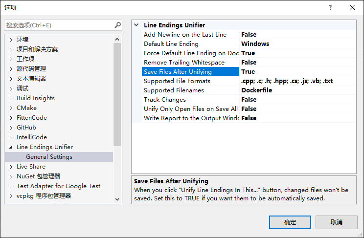

# 用Fitten导致行尾不是CRLF的bug

使用插件 `Line Endings Unifier`

## 插件地址：

复制链接后下载：https://github.com/hlmandy/MandyKnowledgeCollect/blob/main/docs/03_coding/01_CPP/_assets/LineEndingsUnifier.vsix

双击安装

## 插件设置：
