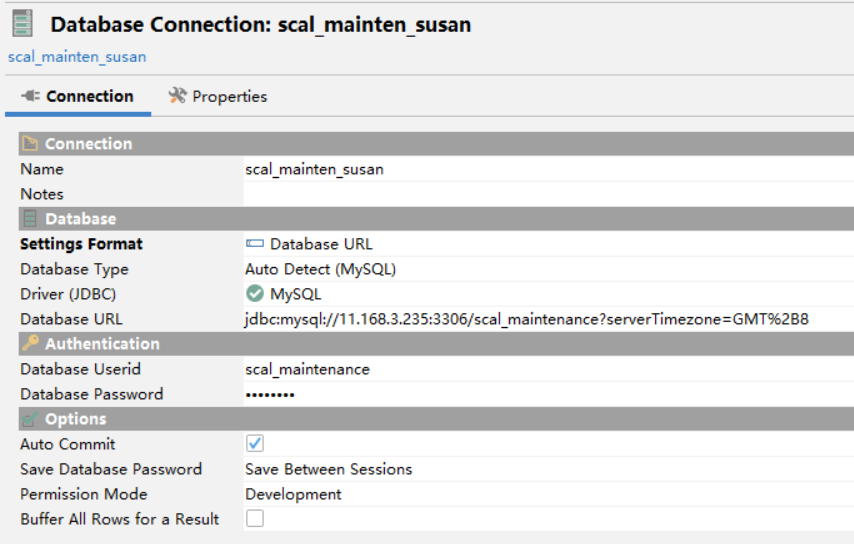

https://bugs.mysql.com/
## 数据库连接
### dbv数据库连接配置



注意：要用jdbc配置，不然时区会变成美国时间，差13个小时

### Pycharm
Pycharm 的优点是可以把查询结果 pin 起来

## python_api
```python
from sqlalchemy import create_engine, text
import pandas as pd

class DatabaseConnection:
    def __init__(self, connection_string="mysql+pymysql://username:pw@address:port/database"):
        self.connection_string = connection_string
        self.engine = None
        self.connection = None

    def __enter__(self):
        self.engine = create_engine(self.connection_string)
        self.connection = self.engine.connect()
        return self.connection

    def __exit__(self, exc_type, exc_val, exc_tb):
        self.connection.close()
        self.engine.dispose()
```

## 建表

```mysql
-- 查询建表语句
SHOW CREATE TABLE `table_name`;

-- 通过 SELECT 来建表
CREATE TABLE `table_name`
SELECT ...;

-- 建空表
-- (! 待施工)

```

### 加主键

```sql
alter table scal_maintenance.hl_fuel_data
add primary key (flt_id);
```

## 建视图view

```sql
CREATE OR replace view `view_name` AS
SELECT  ...
```

## SQL 语句
查询字典：《MySQL 8.0 Reference Manual》第12章 [MySQL 8.0 Reference Manual](MySQL%208.0%20Reference%20Manual.pdf)

### 时间
```sql
DATE(timestamp) -- 取日期
```

#### 时间相减

```sql
-- hour diff
TIMESTAMPDIFF(HOUR,timestamp1,timestamp2)
```

### 数值相关

```mysql
ROUND(3.45,1)  -- 得到3.5
```

### 字符串

```mysql
CONCAT(str1,str2,...)  -- 字符串拼接
```


## 查询语句中变量设置

```mysql
SET @var_name = `var_value` COLLATE utf8mb4_general_ci;  -- then use the @var_name
```
### python中如何写
由于需要先运行 `SET...`

```python
def select_data(query, pre_query=None):
    with DatabaseConnection() as conn:
        for q in pre_query:
            conn.execute(text(q))
        return pd.read_sql(query, conn)

# eg.
var = `var_value`
pre_query = [
    f"SET @var_name = '{var}' COLLATE utf8mb4_general_ci"]
query = "..."
```

## SQL实例
### cumsum
```sql
SELECT `groupby_cols`, SUM(`sum_col`) OVER(ORDER BY `order_col` ASC)
FROM ...;
```
