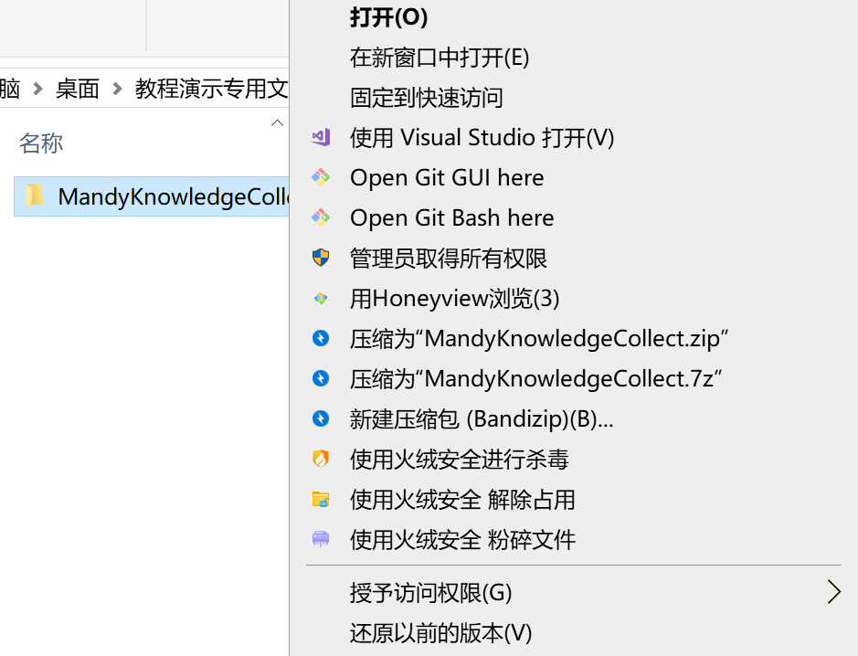
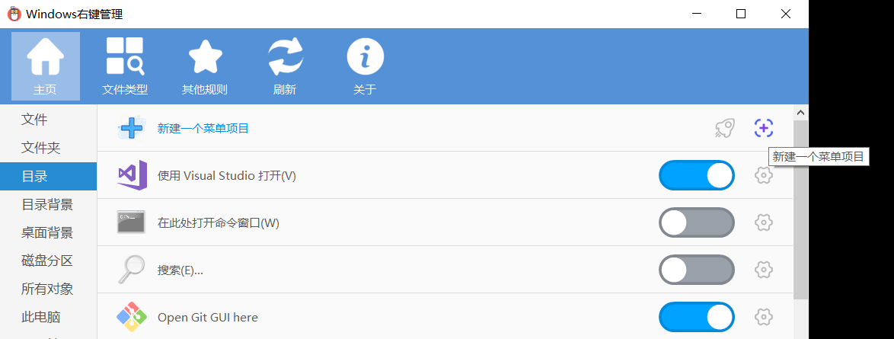

## ❓问题描述

文件夹右键没有“使用 VSCode 打开”这一选项：


## ✔️解决方法：

1. 下载并安装 Context Menu Manager
https://github.com/BluePointLilac/ContextMenuManager
Release 选择一个版本安装

2. 在目录Tab 增加 "使用 VSCode 打开"
`新建一个菜单项目`



**命名：**“使用 VSCode 打开”
**命令：** ↓（注意修改 {YourUserName}）
```
"C:\Users\{YourUserName}\AppData\Local\Programs\Microsoft VS Code\Code.exe" "%V"
```

添加完成之后，可以设置图标，会自动提示。

> 如果想在目录打开之后使用VSCode打开，可以在"目录背景"Tab也进行相同的设置
